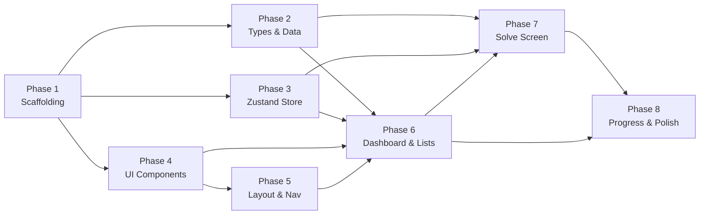

# JS Loop & Iteration Mastery Trainer — Phased Implementation Plan

> **Goal**: Build a fully client-side SPA for practicing JS loop patterns, inspired by NeetCode's clean dark aesthetic. No backend, localStorage persistence, sandboxed code execution.

---

## Git Branching Workflow

Every phase is developed on its own feature branch. **No work happens directly on `main`.**

### Rules

1. **Before starting any phase**, create a new branch from the latest `main`:
   ```bash
   git checkout main
   git pull origin main
   git checkout -b <branch-name>
   ```
2. **Branch naming convention**: `feature/phase-<N>-<short-description>` (see each phase for the exact name).
3. **Commit frequently** within the branch — at minimum one commit per logical sub-task.
4. **When the phase is complete**, push the branch and open it for review:
   ```bash
   git add .
   git commit -m "feat: <phase description>"
   git push origin <branch-name>
   ```
5. **User reviews the branch** — checks code, runs the app, verifies acceptance criteria.
6. **User merges into `main`** after approval (via GitHub PR or local merge).
7. **Only after merge**, the next phase branch is created from the updated `main`.
8. **If a phase needs fixes** after review, commits are added to the same branch — no new branch until merge.

### Branch Overview

| Phase | Branch Name | Merges Into |
|-------|-------------|-------------|
| 1 | `feature/phase-1-scaffolding` | `main` |
| 2 | `feature/phase-2-types-data` | `main` |
| 3 | `feature/phase-3-zustand-store` | `main` |
| 4 | `feature/phase-4-ui-components` | `main` |
| 5 | `feature/phase-5-layout-navigation` | `main` |
| 6 | `feature/phase-6-dashboard-problems` | `main` |
| 7 | `feature/phase-7-solve-screen` | `main` |
| 8 | `feature/phase-8-progress-polish` | `main` |

---

## Phase 1 — Project Scaffolding & Design Foundation

**Branch**: `feature/phase-1-scaffolding`

**Objective**: Vite + React + TS project initialized, all dependencies installed, Tailwind configured dark-only, Google Fonts loaded, global CSS tokens set.

### Tasks

- [ ] **1.0** Initialize git repo on `main`, create branch `feature/phase-1-scaffolding`
- [ ] **1.1** Scaffold Vite React-TS project in the workspace root (`npx -y create-vite@latest ./ --template react-ts`)
- [ ] **1.2** Install runtime dependencies: `react-router-dom`, `zustand`, `date-fns`, `canvas-confetti`, `lucide-react`, `@monaco-editor/react`
- [ ] **1.3** Install dev dependency: `tailwindcss @tailwindcss/vite`
- [ ] **1.4** Configure Tailwind — `tailwind.config.js` with `darkMode: 'class'`, extend colors with the full design-system palette (background-primary `#0a0a0a` through accent-purple `#a855f7`), extend fontFamily for `inter` and `jetbrains`
- [ ] **1.5** Set up `src/index.css` — import Tailwind layers, import Inter + JetBrains Mono from Google Fonts, set `html` to `dark` class, base font 14px, background `#0a0a0a`, text white
- [ ] **1.6** Clean up Vite boilerplate — remove default `App.css`, demo content in `App.tsx`, favicon
- [ ] **1.7** Create folder structure skeleton (empty files/dirs): `components/layout/`, `components/ui/`, `components/editor/`, `components/problems/`, `components/progress/`, `data/problems/`, `runner/`, `store/`, `types/`, `pages/`, `hooks/`
- [ ] **1.8** Configure `@/` path alias in `tsconfig.json` and `vite.config.ts`
- [ ] **1.9** Verify `npm run dev` runs with a blank dark page, no errors
- [ ] **1.10** Commit all, push `feature/phase-1-scaffolding` → **STOP, wait for user review & merge**

### Acceptance

App loads at `localhost:5173`, dark background `#0a0a0a`, Inter font active, no console errors.

### 🔀 Gate

> User reviews branch `feature/phase-1-scaffolding`, merges to `main`, then signals to proceed.

---

## Phase 2 — Types, Data Layer & Seed Problems

**Branch**: `feature/phase-2-types-data`

**Objective**: All TypeScript types defined, category metadata set, 11 category files with 2 seed problems each (22 total), flat index barrel export working.

### Tasks

- [ ] **2.0** Checkout `main` (post-merge), create branch `feature/phase-2-types-data`
- [ ] **2.1** Create `src/types/problem.ts` — `Difficulty` type, `Problem` interface, `CategorySlug` union type for all 11 slugs
- [ ] **2.2** Create `src/data/categories.ts` — export array of category objects: `{ slug, title, description, accentColor }` for all 11 categories
- [ ] **2.3** Create `src/data/problems/basic-loops.ts` — 2 seed problems ("Sum an Array", "Find the Max") with full `Problem` shape including description, whatShouldHappen, starterCode, traceTable, skeletonHint, solution, tests, patternTag, patternExplanation, estimatedMinutes
- [ ] **2.4** Create `src/data/problems/reverse-loops.ts` — 2 seed problems
- [ ] **2.5** Create `src/data/problems/for-in-for-of.ts` — 2 seed problems
- [ ] **2.6** Create `src/data/problems/nested-loops.ts` — 2 seed problems
- [ ] **2.7** Create `src/data/problems/array-building.ts` — 2 seed problems
- [ ] **2.8** Create `src/data/problems/object-loops.ts` — 2 seed problems
- [ ] **2.9** Create `src/data/problems/two-pointer.ts` — 2 seed problems
- [ ] **2.10** Create `src/data/problems/prefix-suffix.ts` — 2 seed problems
- [ ] **2.11** Create `src/data/problems/sliding-window.ts` — 2 seed problems
- [ ] **2.12** Create `src/data/problems/polyfills.ts` — 2 seed problems ("Implement forEach", "Implement map")
- [ ] **2.13** Create `src/data/problems/tricky-patterns.ts` — 2 seed problems
- [ ] **2.14** Create `src/data/index.ts` — import all 11 files, merge into single flat `problems` array export + helper functions: `getProblemById(id)`, `getProblemsByCategory(slug)`, `getCategories()`
- [ ] **2.15** Commit all, push `feature/phase-2-types-data` → **STOP, wait for user review & merge**

### Acceptance

`import { problems } from '@/data'` returns 22 problems. Each matches the `Problem` type. No TS errors.

### 🔀 Gate

> User reviews branch `feature/phase-2-types-data`, merges to `main`, then signals to proceed.

---

## Phase 3 — State Management (Zustand Store)

**Branch**: `feature/phase-3-zustand-store`

**Objective**: Zustand store with localStorage persistence handles solve tracking, streaks, attempts, backup banner dismissal, and import/export.

### Tasks

- [ ] **3.0** Checkout `main` (post-merge), create branch `feature/phase-3-zustand-store`
- [ ] **3.1** Create `src/store/useProgressStore.ts` — state shape: `solvedProblems`, `lastActiveDate`, `currentStreak`, `longestStreak`, `dismissedBackupMilestone`
- [ ] **3.2** Implement `markSolved(id)` action — add to `solvedProblems` with ISO timestamp, streak logic using `differenceInCalendarDays` from date-fns
- [ ] **3.3** Implement `incrementAttempts(id)` action
- [ ] **3.4** Implement `resetProgress()` action
- [ ] **3.5** Implement `dismissBackupBanner(milestone)` action
- [ ] **3.6** Wire zustand `persist` middleware — localStorage key `js-trainer-progress`
- [ ] **3.7** Create `src/hooks/useProgress.ts` — derived selectors: `solvedCount`, `totalCount`, `isSolved(id)`, `categoryProgress(slug)`, `streakInfo`, `shouldShowBackupBanner`
- [ ] **3.8** Commit all, push `feature/phase-3-zustand-store` → **STOP, wait for user review & merge**

### Acceptance

Calling `markSolved` in dev console updates localStorage. Streak increments correctly on consecutive days. `resetProgress` clears everything.

### 🔀 Gate

> User reviews branch `feature/phase-3-zustand-store`, merges to `main`, then signals to proceed.

---

## Phase 4 — Shared UI Components

**Branch**: `feature/phase-4-ui-components`

**Objective**: All reusable UI primitives built and visually verified in isolation.

### Tasks

- [ ] **4.0** Checkout `main` (post-merge), create branch `feature/phase-4-ui-components`
- [ ] **4.1** Create `src/components/ui/Badge.tsx` — difficulty badge (Beginner/Easy/Medium/Hard) with correct color-at-15%-opacity backgrounds + full-color text; also category badge variant
- [ ] **4.2** Create `src/components/ui/ProgressRing.tsx` — circular SVG progress ring, configurable size/stroke/color/progress percentage
- [ ] **4.3** Create `src/components/ui/Toast.tsx` — fixed bottom-right toast, success (green border) / error (red border), auto-dismiss 3s, slide-in animation from right
- [ ] **4.4** Create `src/components/ui/Divider.tsx` — thin `#2a2a2a` horizontal divider
- [ ] **4.5** Create `src/components/ui/Modal.tsx` — centered overlay modal for confirmations (e.g. reset code)
- [ ] **4.6** Create `src/components/progress/StatCard.tsx` — metric card with left accent border, label 12px muted, value 24px white
- [ ] **4.7** Commit all, push `feature/phase-4-ui-components` → **STOP, wait for user review & merge**

### Acceptance

Each component renders correctly in a test page with correct colors, spacing, animations per the design system.

### 🔀 Gate

> User reviews branch `feature/phase-4-ui-components`, merges to `main`, then signals to proceed.

---

## Phase 5 — Layout Shell & Navigation

**Branch**: `feature/phase-5-layout-navigation`

**Objective**: Fixed sidebar, routing, responsive layout, bottom tab bar on mobile — navigating between all routes renders correct empty pages.

### Tasks

- [ ] **5.0** Checkout `main` (post-merge), create branch `feature/phase-5-layout-navigation`
- [ ] **5.1** Create `src/components/layout/Sidebar.tsx` — 240px fixed left, `#111111` bg, right border, logo (lucide `Repeat2` + "JS Trainer"), nav links (Dashboard, Problems, Progress) with lucide icons, active state (blue left border + `#1a1a1a` bg), bottom stat pills (streak, solved, total)
- [ ] **5.2** Create `src/components/layout/Layout.tsx` — sidebar + content area wrapper, max-width 1200px centered content, responsive: sidebar collapses to bottom tab bar on mobile (`< 768px`)
- [ ] **5.3** Set up `react-router-dom` in `App.tsx` — `BrowserRouter`, routes: `/`, `/problems`, `/category/:slug`, `/problem/:id`, `/progress`
- [ ] **5.4** Create placeholder page components: `Dashboard.tsx`, `ProblemsPage.tsx`, `CategoryPage.tsx`, `ProblemPage.tsx`, `ProgressPage.tsx` — each shows just a title so routing is verifiable
- [ ] **5.5** Wire sidebar nav links to routes, highlight active link based on current path
- [ ] **5.6** Wire sidebar bottom stats to zustand store (live solved count, streak, total)
- [ ] **5.7** Commit all, push `feature/phase-5-layout-navigation` → **STOP, wait for user review & merge**

### Acceptance

All 5 routes navigable via sidebar. Active link highlights correctly. Mobile shows bottom tab bar. Stats in sidebar reflect store state.

### 🔀 Gate

> User reviews branch `feature/phase-5-layout-navigation`, merges to `main`, then signals to proceed.

---

## Phase 6 — Dashboard & Problem List Pages

**Branch**: `feature/phase-6-dashboard-problems`

**Objective**: Dashboard with stat cards + category grid, Problems page with full filterable table, Category page with filtered view — all wired to real data.

### Tasks

- [ ] **6.0** Checkout `main` (post-merge), create branch `feature/phase-6-dashboard-problems`

#### 6A — Dashboard (`/`)

- [ ] **6.1** Build top stats row — 4 `StatCard`s: Total Solved, Current Streak, Longest Streak, Categories Started
- [ ] **6.2** Build category grid — 3-col responsive grid (2 tablet, 1 mobile), each card shows: title, description, solved/total counts, `ProgressRing`, colored left border per category
- [ ] **6.3** Wire category cards to navigate to `/category/:slug` on click
- [ ] **6.4** Implement auto-export backup banner — shows after every 10th solve, dismissable, respects `dismissedBackupMilestone`

#### 6B — Problems Page (`/problems`)

- [ ] **6.5** Create `src/components/problems/FilterBar.tsx` — search input, difficulty dropdown, category dropdown, status toggle (All/Solved/Unsolved), live problem count
- [ ] **6.6** Create `src/components/problems/ProblemTable.tsx` — columns: #, Title, Category (badge), Pattern, Difficulty (badge), Time, Status (checkmark/circle). Sticky header, row hover `#1a1a1a`, row click → `/problem/:id`
- [ ] **6.7** Wire filters to table — real-time filtering by search, difficulty, category, status
- [ ] **6.8** Solved rows: subtle green tint on title, green filled checkmark, hover tooltip with solve date

#### 6C — Category Page (`/category/:slug`)

- [ ] **6.9** Build category header — title 20px, description 13px, "X / Y solved" right-aligned
- [ ] **6.10** Reuse `FilterBar` + `ProblemTable` pre-filtered to the category slug from URL params
- [ ] **6.11** Commit all, push `feature/phase-6-dashboard-problems` → **STOP, wait for user review & merge**

### Acceptance

Dashboard renders 4 stat cards + 11 category cards with correct colors and progress rings. Problems page filters work in real time. Category page shows only matching problems.

### 🔀 Gate

> User reviews branch `feature/phase-6-dashboard-problems`, merges to `main`, then signals to proceed.

---

## Phase 7 — Solve Screen (Code Editor + Execution Engine)

**Branch**: `feature/phase-7-solve-screen`

**Objective**: Full problem-solving experience — description panel, Monaco editor, sandboxed code execution, test results, confetti on success, solution reveal.

### Tasks

- [ ] **7.0** Checkout `main` (post-merge), create branch `feature/phase-7-solve-screen`

#### 7A — Code Execution Engine

- [ ] **7.1** Create `src/runner/executor.ts` — sandboxed iframe pattern: build HTML string with user code + test runner, inject via `srcdoc` in sandbox iframe, `postMessage` results back, 5s timeout, catch syntax/runtime/infinite-loop errors
- [ ] **7.2** Return structured results: `{ input, expected, actual, passed, error }[]`
- [ ] **7.3** Test executor in isolation with a known-good function and known-bad function

#### 7B — Solve Screen Layout

- [ ] **7.4** Create `src/components/layout/TopBar.tsx` — breadcrumb (Problems > Category > Title), difficulty + pattern badges center, prev/next arrows + problem counter + estimated time right
- [ ] **7.5** Build `ProblemPage.tsx` two-column layout with draggable resizer — left panel (description) default 40%, right panel (editor) default 60%, save ratio to localStorage
- [ ] **7.6** Implement `useKeyboardShortcut.ts` hook for `Ctrl+Enter` / `Cmd+Enter` → run code

#### 7C — Left Panel Sections

- [ ] **7.7** Section 1 — Problem description: title, description text, example block (dark bg, blue left border, monospace Input/Output)
- [ ] **7.8** Section 2 — "How to think about it": numbered walkthrough steps, custom styled (no browser bullets)
- [ ] **7.9** Create `src/components/problems/TraceTable.tsx` — Section 3: collapsible trace table, toggle show/hide, alternating row colors, monospace values, input label above
- [ ] **7.10** Create `src/components/problems/SkeletonHint.tsx` — Section 4: "I don't know where to start" link, smooth height reveal animation, shows loop structure with blanks
- [ ] **7.11** Create `src/components/problems/SolutionPanel.tsx` — Section 5: locked until first run attempt, then "Show solution" link reveals read-only Monaco with line-by-line comments + pattern callout card

#### 7D — Right Panel (Editor + Results)

- [ ] **7.12** Create `src/components/editor/CodeEditor.tsx` — Monaco editor configured: vs-dark theme overridden to `#0a0a0a` bg, JetBrains Mono 14px, no minimap, line numbers on, loads starter code, reset code with confirmation modal
- [ ] **7.13** Create `src/components/editor/ResultsPanel.tsx` — 220px bottom panel: default "Run your code" message, after run shows test cards (green/red left border), pass/fail per test with Input/Expected/Got
- [ ] **7.14** Implement "All X tests passed" banner — green tinted bar, `canvas-confetti` fires once, "Next Problem →" button
- [ ] **7.15** Implement Run button — full width, spinner 500ms minimum, "Running..." text, triggers executor, updates results panel
- [ ] **7.16** Wire `markSolved` + `incrementAttempts` to store on run results
- [ ] **7.17** Commit all, push `feature/phase-7-solve-screen` → **STOP, wait for user review & merge**

### Acceptance

Can type code in Monaco, run it, see test results. Correct solution triggers confetti + green banner. Solution panel unlocks after first attempt. Trace table and skeleton hint toggle correctly. Prev/Next navigation works between problems.

### 🔀 Gate

> User reviews branch `feature/phase-7-solve-screen`, merges to `main`, then signals to proceed.

---

## Phase 8 — Progress Page & Final Polish

**Branch**: `feature/phase-8-progress-polish`

**Objective**: Progress page with heatmap + history, export/import working, responsive polish, edge cases handled.

### Tasks

- [ ] **8.0** Checkout `main` (post-merge), create branch `feature/phase-8-progress-polish`

#### 8A — Progress Page

- [ ] **8.1** Build progress page stats row — 3 `StatCard`s (Current Streak, Longest Streak, Total Solved)
- [ ] **8.2** Create `src/components/progress/CalendarHeatmap.tsx` — GitHub-style SVG heatmap, 52 weeks × 7 days, cell 12×12 + 3px gap, 4-level green color scale, month labels top, day labels (M/W/F) left, hover tooltip with date + problem titles
- [ ] **8.3** Create `src/components/progress/SolveHistory.tsx` — reverse-chronological list grouped by date, each row: problem title, category + difficulty badges, time of solve; click navigates to problem
- [ ] **8.4** Implement Export — serialize zustand store to JSON, trigger download as `js-trainer-progress-YYYY-MM-DD.json`
- [ ] **8.5** Implement Import — file picker, FileReader, validate JSON shape (`solvedProblems` key), `setState`, success/error toast

#### 8B — Final Polish

- [ ] **8.6** Responsive audit — test all pages at mobile (375px), tablet (768px), desktop (1280px); fix any layout breaks
- [ ] **8.7** Keyboard accessibility — tab navigation on sidebar, filter bar, problem table rows, modal focus trap
- [ ] **8.8** Loading states — skeleton/placeholder states for editor mount, heatmap render
- [ ] **8.9** Edge cases — empty states (no solved problems, no search results), 0-problem categories
- [ ] **8.10** Performance — React.memo on heavy components (ProblemTable rows, heatmap cells), lazy load Monaco editor
- [ ] **8.11** Final visual QA — verify all colors, spacing, typography, transitions match the design system spec exactly
- [ ] **8.12** Verify `npm run build` succeeds with no errors or warnings
- [ ] **8.13** Commit all, push `feature/phase-8-progress-polish` → **STOP, wait for user review & merge**

### Acceptance

Full app functional end-to-end. Export downloads valid JSON. Import restores state + shows toast. Heatmap renders solve history correctly. App builds for production without errors.

### 🔀 Gate

> User reviews branch `feature/phase-8-progress-polish`, merges to `main`. **Project complete.** 🎉

---

## Phase Dependency Graph



> [!IMPORTANT]
> Phases 2, 3, and 4 can be worked on in parallel after Phase 1 completes. However, since we use a **sequential branch-and-merge** workflow, they will be done one at a time: Phase 2 → merge → Phase 3 → merge → Phase 4 → merge. This keeps the review cycle clean.

---

## AI Workflow Instructions

When executing this plan, the AI must follow this exact workflow for each phase:

1. **Check current branch** — confirm we are on `main` and it is up to date
2. **Create the phase branch** — use the exact branch name from the plan
3. **Work through tasks sequentially** — tick off `[ ]` → `[x]` as each is completed
4. **Verify acceptance criteria** — run the app, check for errors
5. **Commit and push** — with a clear commit message
6. **STOP and report** — tell the user the phase is ready for review
7. **Wait** — do NOT start the next phase until the user explicitly says to proceed

---

## Summary

| Phase     | Branch Name                          | Est. Tasks | Key Deliverable                             |
| --------- | ------------------------------------ | ---------- | ------------------------------------------- |
| 1         | `feature/phase-1-scaffolding`        | 10         | Running Vite app with dark theme            |
| 2         | `feature/phase-2-types-data`         | 15         | 22 typed seed problems across 11 categories |
| 3         | `feature/phase-3-zustand-store`      | 8          | Zustand store with persistence + streaks    |
| 4         | `feature/phase-4-ui-components`      | 7          | Badge, ProgressRing, Toast, Modal, StatCard |
| 5         | `feature/phase-5-layout-navigation`  | 7          | Sidebar, routing, responsive shell          |
| 6         | `feature/phase-6-dashboard-problems` | 11         | 3 fully functional pages with filters       |
| 7         | `feature/phase-7-solve-screen`       | 17         | Monaco editor + sandboxed runner + confetti |
| 8         | `feature/phase-8-progress-polish`    | 13         | Heatmap, export/import, responsive QA       |
| **Total** |                                      | **88**     | **Complete app**                            |
